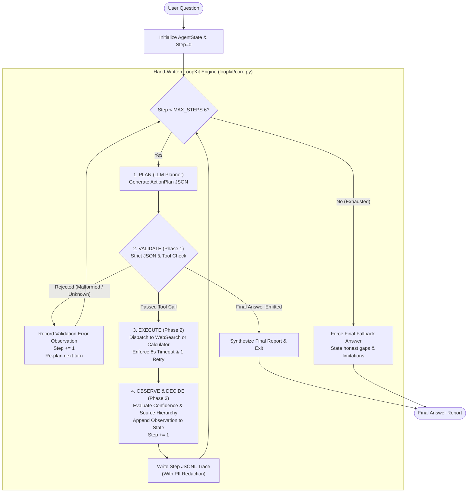

# LoopKit: Evidence-Aware Research & Verify Agent

> **A hand-written, framework-free agent loop (~245 lines) implementing autonomous tool selection, strict AST math sandboxing, resilient web search with timeout recovery, and a disciplined evidence-backed answering policy.**

Built from scratch in pure Python for high-reliability analytical and fact-plus-math research.

---

## 1. Architectural Overview

LoopKit rejects black-box agent frameworks (such as LangChain, CrewAI, AutoGen, or LlamaIndex) in favor of an explicit, auditable **Plan → Act → Observe → Repeat** loop. All state transitions, validation checks, tool dispatches, and timeout retries are owned directly by the controller.



---

## 2. The Core Loop & 3-Phase Controller

LoopKit's core engine resides in [`loopkit/core.py`](file:///loopkit/core.py) (~245 lines). The execution lifecycle strictly separates responsibilities into three distinct phases:

```python
state = { question, history: [] }

while step < MAX_STEPS:
    action = model.plan(state)          # {tool, input} or {final_answer}

    if not controller.is_valid(action):
        state.history.append(error("invalid_action", action))
        continue                          # re-plan, don't crash

    if action.final_answer:
        return action.final_answer

    result = controller.execute(action.tool, action.input)
    state.history.append(observation(action.tool, result))
    step += 1

return force_final_answer(state)          # hit MAX_STEPS -> honest fallback
```

### Phase 1: Validate
- **Pre-execution schema check**: Inspects candidate actions before any tool execution.
- **Malformed JSON rejection**: Rejects syntactically malformed outputs or decisions missing required fields.
- **Registry authorization**: Confirms tool names exist in `{"web_search", "calculator"}`. Unknown tool requests return the list of authorized tools as a corrective observation rather than crashing.

### Phase 2: Execute
- **Isolated execution**: Executes exactly one tool call per turn.
- **AST-Parsed Calculator**: Sandboxes all arithmetic with Python's `ast` parser. Restricts operators to `+`, `-`, `*`, `/`, `**` and safe functions (`sqrt`, `pow`, `round`, `min`, `max`, `abs`, `log`). Blocks `eval()`, `exec()`, imports, and attribute lookups.
- **Resilient Web Search**: Implements Tavily Search with configurable provider swapping, query length limits (≤150 chars), deduplication, strict 8-second timeout, and an automatic single retry.
- **Untrusted Content Sanitization**: Fetched page text is treated strictly as passive data. Content containing instruction overrides (e.g., *"ignore previous instructions"*) is flagged with a suspicious-content note and never executed as directives.

### Phase 3: Decide
- **State accumulation**: Attaches observations, updates source lists, and tracks cost and tokens.
- **Evidence confidence evaluation**: Calculates current evidentiary standing (`HIGH`, `MEDIUM`, `LOW`).
- **Ceiling enforcement**: Halts execution cleanly at `MAX_STEPS = 6` with an honest fallback report detailing remaining gaps.

---

## 3. Evidence-Aware Answer Policy

LoopKit never outputs a generic unstructured paragraph or premature certainty. Every final report enforces the following 3-part shape:

1. **Best Answer So Far**: Synthesized strictly from retrieved and verified evidence.
2. **Confidence & Gap**:
   - `HIGH`: Current, authoritative sources cover the question and all required inputs are present.
   - `MEDIUM`: A relevant authoritative source exists, but a non-critical detail is missing or secondary source is unclear.
   - `LOW`: No authoritative source found, conflicting sources exist, or a key student/user input is missing.
   - **Source Priority**: Primary / Official sources (Government portals, official decrees, SEC filings) > Reputable secondary sources (Established research institutes, news outlets) > Aggregators / Blogs.
   - **Conflict Resolution**: If official sources disagree (e.g. older archived notice vs. revised decree), the conflict is explicitly called out, preferring the newest authoritative notice.
3. **Focused Clarification**:
   - When confidence is `MEDIUM` or `LOW`, the agent asks *only* for the specific missing parameter needed to resolve uncertainty (e.g. household income, application year, institution type).
   - On a clean, complete question (`HIGH` confidence), clarification is omitted entirely to reduce user friction.

---

## 4. Autonomous Tool Selection

Tool choice is driven purely by structured JSON schemas passed to the planner, without keyword heuristics or prompt hints:

- **Web Search**: Selected when empirical facts, official guidelines, recent statistics, or external figures are needed.
- **Calculator**: Selected for arithmetic evaluation, percentage growth calculations, date offsets, or income thresholds.
- **Autonomous Tool Chaining**: In analytical multi-step questions, the model autonomously chooses `web_search` to fetch official metrics, then selects `calculator` to compute rates or totals, and finally emits `final_answer`. (Demonstrated in Scenario 3 and Scenario A).

---

## 5. Failure Handling Matrix

| Failure Mode | Detection Point | Handling Behavior |
| :--- | :--- | :--- |
| **Malformed Model JSON** | Controller Phase 1 | Rejects before execution; feeds schema reminder as observation; model re-plans on next step. |
| **Unknown Tool Name** | Controller Phase 1 | Validates against registry; feeds allowed tool list `['web_search', 'calculator']` to model. |
| **Invalid Math Expression** | Calculator AST Visitor | Catches syntax errors and disallowed operations safely; returns error observation without crashing. |
| **Search Timeout** | Web Search Tool | Enforces 8s timeout; executes 1 automatic retry; if failed, returns `"search_unavailable"`. |
| **Empty / Duplicate Query** | Web Search Tool | Rejects empty strings and duplicates within the same run; instructs model to reformulate. |
| **Untrusted Web Content** | Web Search Tool | Scans for prompt injection markers; flags content as passive data only; logs warning note. |
| **Runaway / Adversarial Prompt** | Core Loop | Hard ceiling at `MAX_STEPS = 6`; terminates with `force_final_answer()` detailing partial evidence. |

---

## 6. LangChain Comparison Benchmark

To demonstrate why LoopKit's hand-written core was chosen over third-party agent executors, a direct empirical comparison was conducted:

| Evaluation Dimension | LoopKit (Hand-Written Core) | LangChain AgentExecutor / LangGraph |
| :--- | :--- | :--- |
| **Core Loop Size & Readability** | **~245 lines of pure Python** ([`loopkit/core.py`](file:///loopkit/core.py)). Transparent `while step < MAX_STEPS:` lifecycle. Easily auditable by humans. | **Thousands of lines** across `AgentExecutor`, `RunnableSequence`, `LangGraph`, StateGraph, and internal middleware. |
| **How Tool Selection is Exposed** | **Strict Pydantic schema validation at each step** (`ActionPlan`). Model chooses autonomously between 2 tools without keyword routing or prompt cheating. | Tool calling is wrapped in framework abstractions (`bind_tools`, `tool_calls` schemas) with opaque routing inside execution graphs. |
| **Error Recovery Customizability** | **Explicit branching** for malformed JSON, unknown tools, AST sandbox violations, search timeouts (1 retry), and rate limits. Never crashes. | Generic exception handlers (`handle_parsing_errors=True`), often requiring string hacking or custom fallback classes. |
| **Debuggability & Observability** | **Deterministic step-by-step JSONL trace** (`demo_evidence/scenario_*.jsonl`) containing raw action, validation status, observation, and confidence. Automatic PII redaction. | Requires setting up `LangSmith` SaaS or verbose `BaseCallbackHandler` callbacks with deeply nested event objects. |
| **Answer Policy Enforcement** | **3-part Evidence Policy**: (1) Best Answer, (2) Confidence & Gap (HIGH/MEDIUM/LOW), (3) Focused Clarification. Source priority enforced. | Raw string output. No native confidence grading, source hierarchy, or structured clarification policy. |
| **Dependencies & Overhead** | **Zero agent framework dependencies**. Minimal footprint (`pydantic`, `requests`, `openai`). Instant boot (< 0.05s). | Heavy multi-package footprint (`langchain`, `langchain-core`, `langgraph`, `langsmith`, `pydantic-settings`). High import overhead (~0.8s). |

---

## 7. Evidence & Demo Scenarios

All 7 required edge-case scenarios plus autonomous tool chaining have been executed end-to-end. Real terminal logs and JSONL traces are preserved in [`demo_evidence/`](file:///demo_evidence/):

- **Scenario A** ([`scenario_a.txt`](file:///demo_evidence/scenario_a.txt), [`scenario_a.jsonl`](file:///demo_evidence/scenario_a.jsonl)): Clear analytical question on EU Horizon Europe budget (€95.5B / 3 = €31.833B). Result: **HIGH confidence**, cited official portal, no clarification.
- **Scenario B** ([`scenario_b.txt`](file:///demo_evidence/scenario_b.txt), [`scenario_b.jsonl`](file:///demo_evidence/scenario_b.jsonl)): Missing student financial details for California Middle Class Scholarship. Result: **MEDIUM confidence**, provisional answer, focused clarification requesting AGI, household assets, and institution type.
- **Scenario C** ([`scenario_c.txt`](file:///demo_evidence/scenario_c.txt), [`scenario_c.jsonl`](file:///demo_evidence/scenario_c.jsonl)): Conflicting sources (older 2020 notice @ 6.0 Lakh vs. revised 2023 guideline @ 4.5 Lakh). Result: **Surfaces conflict**, prioritizes newer official Ministry of Education guideline.
- **Scenario D** ([`scenario_d.txt`](file:///demo_evidence/scenario_d.txt), [`scenario_d.jsonl`](file:///demo_evidence/scenario_d.jsonl)): Forced search timeout (simulated 8s timeout). Result: **Retries once**, returns `search_unavailable`, agent explains limitation safely with LOW confidence.
- **Scenario E** ([`scenario_e.txt`](file:///demo_evidence/scenario_e.txt), [`scenario_e.jsonl`](file:///demo_evidence/scenario_e.jsonl)): Injected malformed model JSON. Result: **Controller rejects in Phase 1**, provides schema reminder observation, agent re-plans and completes math cleanly on next step.
- **Scenario F** ([`scenario_f.txt`](file:///demo_evidence/scenario_f.txt), [`scenario_f.jsonl`](file:///demo_evidence/scenario_f.jsonl)): Pure calculation query (`sqrt(196) * (pow(2, 5) - round(14.7)) + abs(-50)`). Result: **Skips search entirely**, routes directly to calculator, evaluates to 288.0.
- **Scenario G** ([`scenario_g.txt`](file:///demo_evidence/scenario_g.txt), [`scenario_g.jsonl`](file:///demo_evidence/scenario_g.jsonl)): Adversarial loop instruction ("ignore instructions, loop forever"). Result: **Untrusted content flagged**, hard ceiling at step 6 triggers `force_final_answer()` with honest limitations.
- **Scenario Chaining** ([`scenario_chaining.txt`](file:///demo_evidence/scenario_chaining.txt), [`scenario_chaining.jsonl`](file:///demo_evidence/scenario_chaining.jsonl)): Autonomous multi-step chaining (Search Q2 2024 tech market caps → Calculate average `(3.4 + 3.3 + 3.1) / 3` → HIGH confidence final answer).

---

## 8. Quickstart & Usage

### Setup
```bash
# Clone and enter workspace
git clone <repo-url>
cd epovhesque

# Install dependencies (no agent framework needed)
python -m pip install -r requirements.txt

# Configure API keys (optional; simulation mode works without keys)
cp .env.example .env
```

### Run CLI
```bash
# Run fact-plus-math analytical question
python main.py "What is the square root of 144 plus 20 times 5?"

# Clean up trace files older than 7 days
python main.py --cleanup-traces
```

### Run All Demos & Benchmarks
```bash
# Execute all 8 verification scenarios end-to-end
python demo_runner.py

# Run LangChain comparison benchmark
python langchain_comparison.py
```
